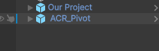
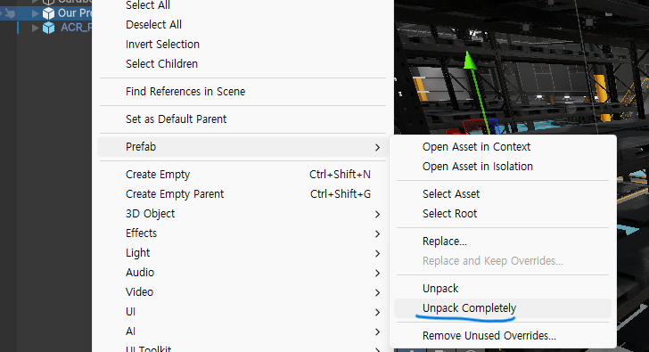
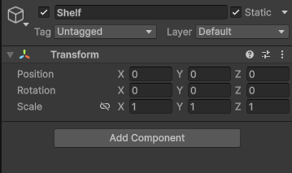
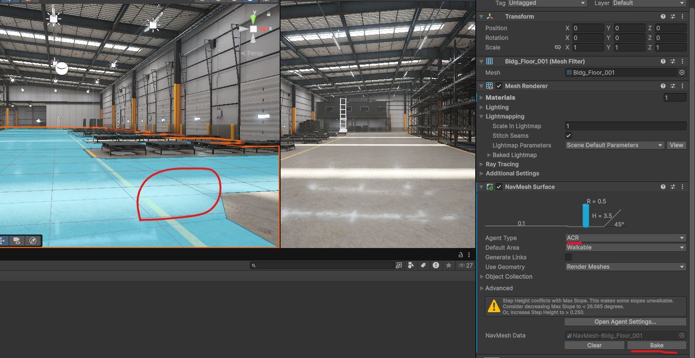
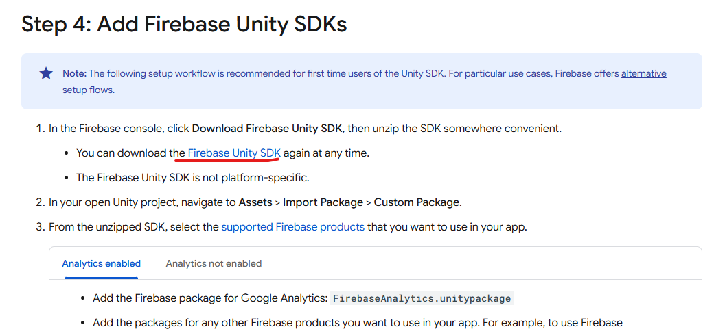

# ACR-Firebase 프로젝트

이 프로젝트는 자율 이동 로봇(AMR) 시뮬레이션 환경에 Firebase Firestore 데이터베이스를 연동하는 방법을 다룹니다.

##  목차

- [프로젝트 설정](#-프로젝트-설정)
- [Firebase 연동](#-firebase-연동)

---

## ? 프로젝트 설정

기본 환경을 설정하고 장애물(Obstacle)을 배치하는 과정입니다.

1.  **프로젝트 파일 다운로드 및 적용**
    -   제공된 `.zip` 파일을 다운로드합니다.
    -   압축을 해제한 후, 기존 Unity 프로젝트 폴더에 **덮어씌웁니다.**

2.  **공유 오브젝트(Share Object) 배치**
    -   Unity 에디터의 `Project` 창에서 `Assets/Share` 폴더로 이동합니다.
    -   `Our Project`, `ACR_Pivot` 에셋을 `Hierarchy` 창으로 드래그 앤 드롭하여 씬에 배치합니다.

    

3.  **프리팹(Prefab) 연결 해제**
    -   `Hierarchy` 창에서 `Our Project`와 `ACR_Pivot` 오브젝트를 각각 선택합니다.
    -   마우스 우클릭 후 `Prefab > Unpack Completely`를 선택하여 프리팹과의 연결을 완전히 해제합니다. 이는 오브젝트를 자유롭게 수정하기 위함입니다.

    

4.  **장애물 Static 설정**
    -   씬에 배치된 장애물(선반, 벽 등) 역할을 하는 모든 게임 오브젝트를 선택합니다.
    -   `Inspector` 창 우측 상단의 **Static** 드롭다운 메뉴를 클릭하고, **Everything**을 선택합니다. 이는 Unity의 네비게이션 및 라이트매핑 시스템이 해당 오브젝트들을 고정된 환경 요소로 인식하도록 설정하는 중요한 과정입니다.

    

5. **물체가 움직일 바닥 설정**
    -   Unity에서 물체가 움직일 바닥을 클릭한다
    -   Inspector 창에 Navmesh를 추가하고 agent type을 설정하고 bake을 누른다.

     

---

## ? Firebase 연동

Unity 프로젝트에 Firebase Firestore 데이터베이스를 연동하는 과정입니다.

1.  **Firebase Unity SDK 다운로드**
    -   [Firebase 공식 문서](https://firebase.google.com/docs/unity/setup)에 접속합니다.
    -   **`.NET Framework 4.x`** 버전의 SDK (`.zip` 파일)를 다운로드합니다.

    

2.  **필수 패키지 임포트**
    -   다운로드한 SDK의 압축을 해제하면 `dotnet4` 폴더가 있습니다.
    -   아래 **두 개의 `.unitypackage` 파일**을 Unity 프로젝트의 `Assets` 창으로 순서대로 드래그 앤 드롭하여 임포트합니다.

    > ** ?? 전문가 팁:** 종속성 문제를 방지하기 위해 반드시 아래 순서를 지켜주세요.
    >
    > 1.  `FirebaseAuth.unitypackage` (인증 및 핵심 라이브러리)
    > 2.  `FirebaseFirestore.unitypackage` (Firestore 데이터베이스)

3.  **임포트 확인**
    -   각 패키지를 드래그하면 "Import Unity Package" 창이 나타납니다.
    -   모든 항목이 체크된 기본 상태에서 `Import` 버튼을 클릭하여 임포트를 완료합니다.

이제 프로젝트에 Firebase 연동을 위한 모든 준비가 완료되었습니다.